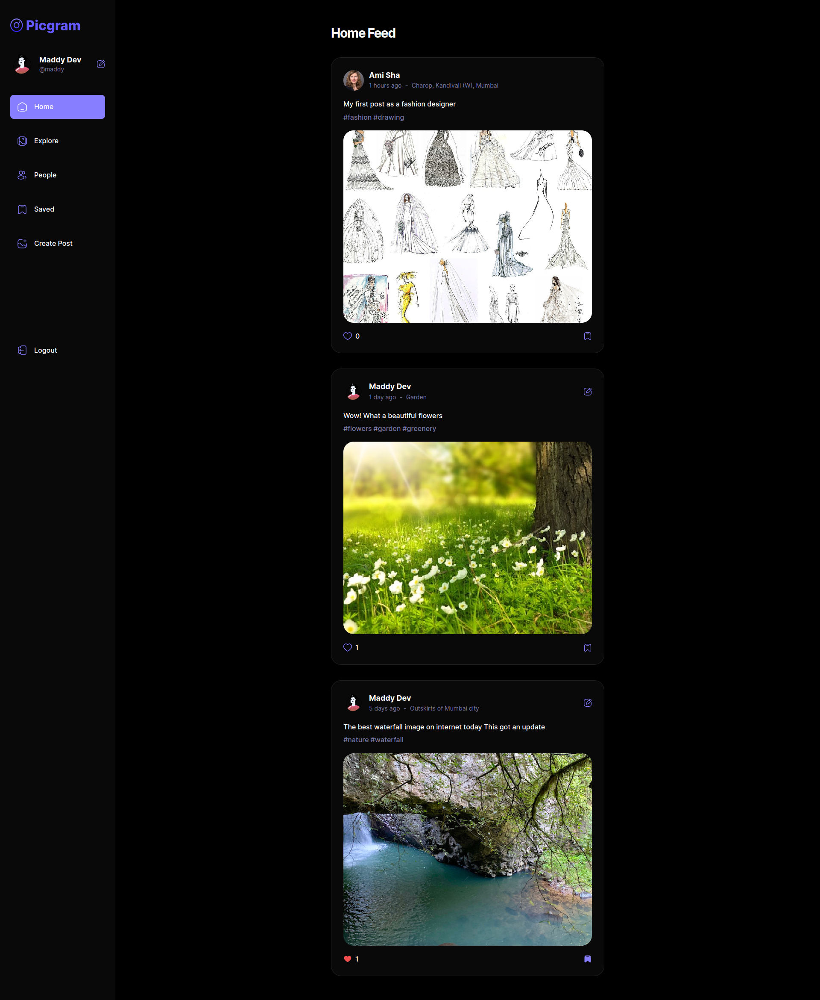
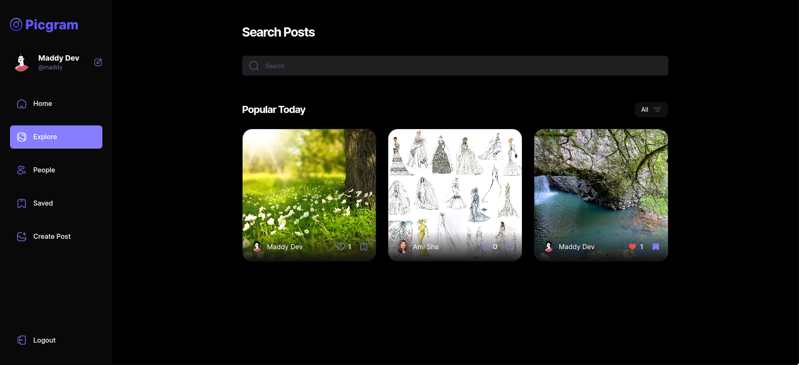
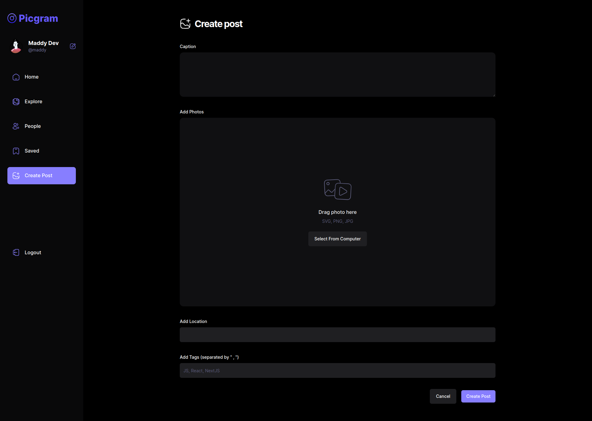
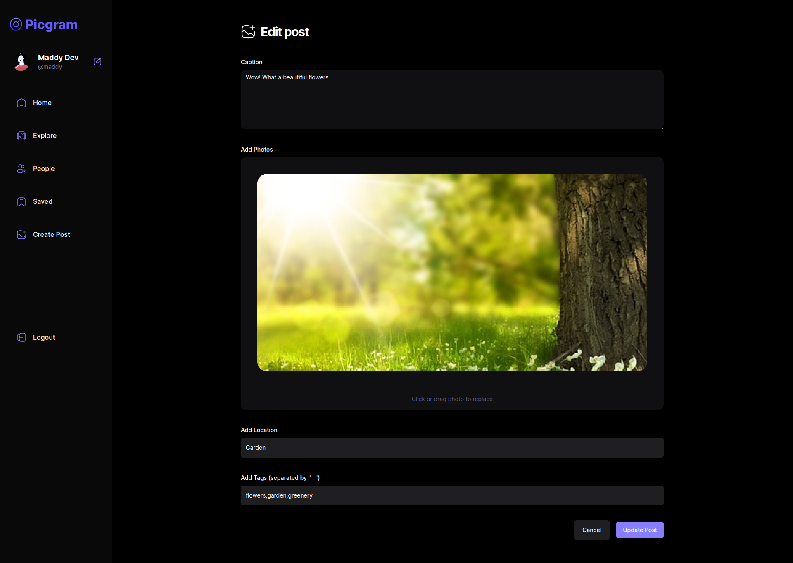

## PicGram

A mini instagram clone where users can Add, Edit, and Delete their image posts.

### Requirements

-   Node >= v20.10.0
-   NPM >= v10.2.3

### Installation:

```bash
git clone git@github.com:MehulBawadia/picgram-react.git
cd picgram
cp .env.example .env
npm install
npm run dev
```

### Screenshots









#### License

This project is an open-sourced software licensed under the [MIT License](https://opensource.org/licenses/MIT).
